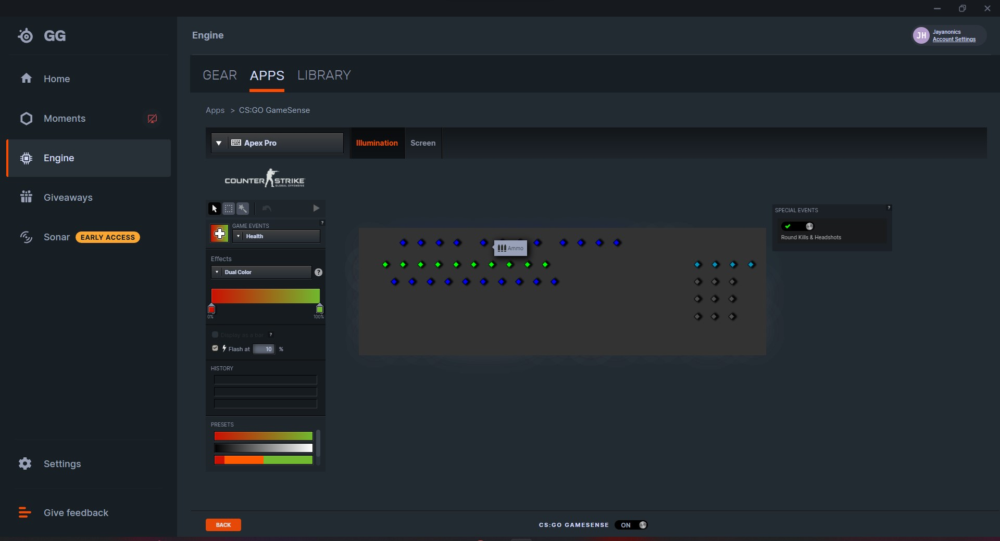
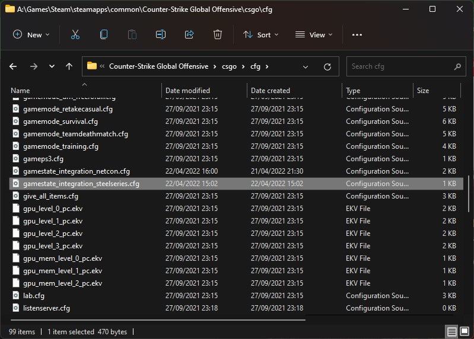
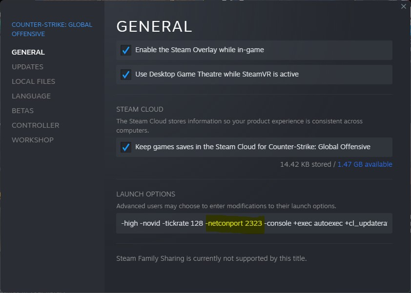

A NodeJS application that combines both the game state integration and netcon features 
offered by csgo into a single application.
## *Short note to the accusing cheaters*
All features interacting with CSGO used in this project are provided by Valve themselves. Unlike a 'cheat':
- This does not inject any code into the game
- Modify the game's code,
- Read memory from the game

Read on to see how this project works and more information on why it's not a cheat.


## Game State Integration
Game state integration is a feature that allows you to get the current state of the game, player, and match.
Game State Integration is completely legitimate. In fact, you may be unaware that you are potentially already using
this feature in your csgo installation. For example, SteelSeries GG and it's RGB CS:GO App uses Valve's
Game State Integration feature for it's lighting effects.
#### The SteelSeries GG CS:GO Settings Panel

And similarly, places its own gamestate_integration_steelseries.cfg file in your csgo installation.
#### File Explorer showing the SteelSeries Game State cfg file


Although this is just a guess, I believe that GameState Integration is also used in the LAN tournaments to trigger
the lighting and pyrotechnic effects.

For more information about game state integration and the features it offers, check out the following links:
- [Reddit Article - Game State Integration](https://www.reddit.com/r/GlobalOffensive/comments/cjhcpy/game_state_integration_a_very_large_and_indepth/)
- [Valve Developers Wiki - Game State Integration](https://developer.valvesoftware.com/wiki/Game_State_Integration)
---

## Netcon
Netcon is a relatively unheard of feature that allows you to have a telnet (TCP) session with your CSGO console.
It is a launch option that can be added to your Steam launch options for CSGO. Once again,
if valve deemed it to be cheating, they could simply remove the launch option from the game. However, since they
have this launch option **all Source Engine games**, it is unlikely that they deem it to be an exploit.

The setup of the netcon feature is very simple. You simply add the
`-netconport PORT_NUMBER_HERE` launch option to your Steam CSGO launch options.
#### Steam Launch Options


Unlike Game State Integration, Netcon is hardly documented in the Valve Developers Wiki. However, it is
mentioned in the following Valve Developers Wiki article:
- [Valve Developers Wiki - Command Line Options](https://developer.valvesoftware.com/wiki/Command_Line_Options)

But this is the secret sauce that, in combination with the data provided by the Game State Integration feature,
allows you to get the current state of the game, player, and match, and send commands to the console based
on this data.

*So what can you do with netcon?*  
The same you can do with the normal CSGO console.  
The difference is that we now have a network connection to the console. We can use this
to both: 
- send commands to the console from another application
- receive log output from the console in another application.

## Summary
While neither of these features on their own are very powerful, they can be combined to create a powerful
application that can be used to get the current state of the game, player, and match, and send commands to the console.

The fact that we can use another programming language to send commands to the console, rather than the console itself,
means we can automate a lot of the repetitive tasks that we do with the console. As well as extend the functionality
of the console.

###### An example of the console limitations:
> A while back I wanted to have a rainbow crosshair in CSGO. How could you solve this?   
> Well you could make a cfg file with a list of aliases that move through colors like so...
> ```
> alias "rainbow_crosshair_color_1" "cl_crosshair_color_r 255; cl_crosshair_color_g 0; cl_crosshair_color_b 0; alias rainbow_crosshair rainbow_crosshair_color_2"
> alias "rainbow_crosshair_color_2" "cl_crosshair_color_r 0; cl_crosshair_color_g 255; cl_crosshair_color_b 0; alias rainbow_crosshair rainbow_crosshair_color_3"
> alias "rainbow_crosshair_color_3" "cl_crosshair_color_r 0; cl_crosshair_color_g 0; cl_crosshair_color_b 255" alias rainbow_crosshair rainbow_crosshair_color_1
> alias "rainbow_crosshair" "rainbow_crosshair_color_1"
> ```
> But the CSGO config file doesn't allow for a loop or time based execution.  
> So you have to manually execute the alias every time you want to change the color.  
> *So what can we do to trigger the execution?*  
> Well we have binds, so lets use that.  
> ```
> ...
> bind "r" "rainbow_crosshair"
> ```
> 
> But incase you can't already see the problem with this, you have to keep pressing **R**.
> 
> *So, how can we implement this rainbow crosshair in our application?*  
> Well, we use a time based loop and send the `cl_crosshair_color` command to the console with the specified rate.
> Lets take a look at this implementation in our NodeJS application.
> ```
> // A rainbow crosshair function that cycles through the rainbow (R,G,B format) at a given rate.
> async function rainbowCrosshair(rate: number) {
>   // The colours array should have 27 intervals (3^3), evenly spaced.
>   const colors = [
>       // Peak Red with green fade in.
>       [255, 0, 0],
>       [255, 64, 0],
>       [255, 128, 0],
>       [255, 192, 0],
>       [255, 255, 0],
>       // Peak green with red fade out.
>       [192, 255, 0],
>       [128, 255, 0],
>       [64, 255, 0],
>       [0, 255, 0],
>       // Peak green with blue fade in.
>       [0, 255, 64],
>       [0, 255, 128],
>       [0, 255, 192],
>       [0, 255, 255],
>       // Peak blue with green fade out.
>       [0, 192, 255],
>       [0, 128, 255],
>       [0, 64, 255],
>       [0, 0, 255],
>       // Peak blue with red fade in.
>       [64, 0, 255],
>       [128, 0, 255],
>       [192, 0, 255],
>       [255, 0, 255],
>       // Peak red with blue fade out.
>       [255, 0, 192],
>       [255, 0, 128],
>       [255, 0, 64],
>   ];
>   do {
>       for(let i = 0; i < colors.length; i++) {
>           // Apply the colours individually to the crosshair with the format:
>           // `cl_crosshaircolor_r; cl_crosshaircolor_g; cl_crosshaircolor_b`
>           // And wait for the max console send rate between each colour change.
>           netcon.send(`cl_crosshaircolor_r ${colors[i][0]}; cl_crosshaircolor_g ${colors[i][1]}; cl_crosshaircolor_b ${colors[i][2]}`);
>           await new Promise(resolve => setTimeout(resolve, rate));
>       }
>   } while(netcon.connectionOpen === true);
> }
> ```
> The result?  
>   
> And there you have it.
